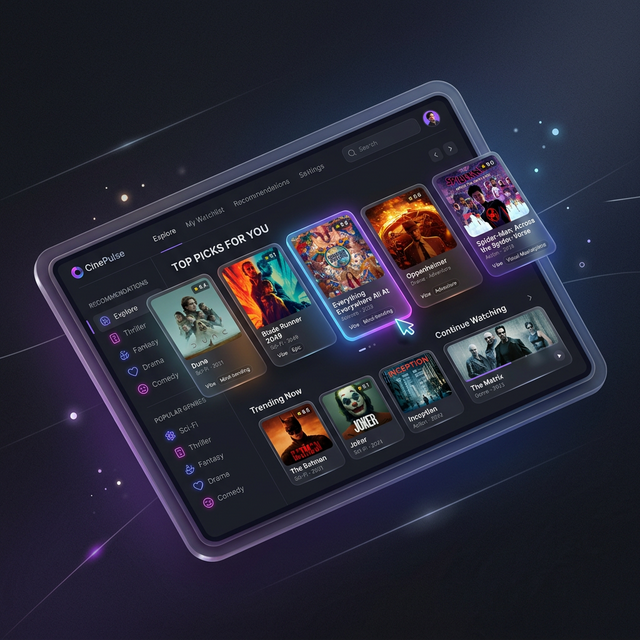

  
  

    
  
  # 🎬 Movie Recommendation System
  
  

    A stunning, full-stack content-based recommendation engine powered by <b>AI & Cosine Similarity</b>.
  

  
  

    
    
    
    
    
  

 

## ✨ Features

<table>
  <tr>
    <td width="50%" style="padding: 20px;">
      <h3 align="center">🧠 Smart Recommendations</h3>
      
Advanced NLP pipeline & cosine similarity matrix predicting films based on plot, genres, cast, and directors across 4,800+ movies.

    </td>
    <td width="50%" style="padding: 20px;">
      <h3 align="center">⚡ Blazing Fast API</h3>
      
Built entirely on Python's FastAPI to instantly stream similarities with near-zero latency and high concurrency.

    </td>
  </tr>
  <tr>
    <td width="50%" style="padding: 20px;">
      <h3 align="center">🎨 Premium UI/UX</h3>
      
Gorgeous glassmorphism user interface designed with Angular 21 & TailwindCSS v4 with rich 3D gradients.

    </td>
    <td width="50%" style="padding: 20px;">
      <h3 align="center">📱 Fully Responsive</h3>
      
Adapts seamlessly to any screen size—from ultrawide desktop monitors to mobile devices with optimized cards.

    </td>
  </tr>
</table>

---

## 🏗️ Architecture Stack

<table>
  <tr>
    <td width="50%" valign="top" style="padding: 20px;">
      <h3 align="center">⚙️ Backend Pipeline (FastAPI)</h3>
      <ul>
        <li><b>Merge Data:</b> Combines TMDB 5k movies & credits</li>
        <li><b>Extraction:</b> JSON nested data (Top-3 Cast, Director)</li>
        <li><b>NLP:</b> Stopword removal & Porter Stemming</li>
        <li><b>Matrix:</b> 5000-dimensional <code>CountVectorizer</code></li>
        <li><b>Compute:</b> Dense Cosine Similarity Matrix</li>
      </ul>
    </td>
    <td width="50%" valign="top" style="padding: 20px;">
      <h3 align="center">💻 Frontend App (Angular)</h3>
      <ul>
        <li><b>Architecture:</b> Standalone component ecosystem</li>
        <li><b>State:</b> Modern Angular Signals for deep reactivity</li>
        <li><b>Services:</b> <code>MovieService</code> with RxJS observables</li>
        <li><b>Styles:</b> TailwindCSS v4 with auto dark/light mode</li>
        <li><b>Icons:</b> Scalable animated SVG elements</li>
      </ul>
    </td>
  </tr>
</table>

---

## 🚀 Quick Start

<table>
  <tr>
    <td width="50%" valign="top" style="padding: 20px;">
      <h3 align="center">1️⃣ Start the Backend API</h3>
      <pre><code>cd Backend
pip install fastapi uvicorn pandas numpy scikit-learn nltk
uvicorn main:app --reload</code></pre>
      
<i>Runs internally at <code>http://localhost:8000</code></i>

    </td>
    <td width="50%" valign="top" style="padding: 20px;">
      <h3 align="center">2️⃣ Start the Frontend App</h3>
       <pre><code>cd Frontend/MovieRecommendationSystem
npm install
ng serve</code></pre>
      
<i>Launch your UI at <code>http://localhost:4200</code></i>

    </td>
  </tr>
</table>

 

---

  
Crafted with 💜 for movie lovers and developers alike.

